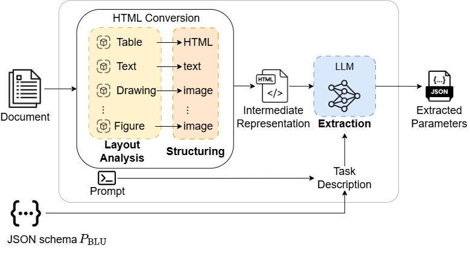

[](https://scorecard.dev/viewer/?uri=github.com/Novia-RDI-Seafaring/MERI)

 

Package for parameter extraction from pdf documents. Provided with a pdf file and json schema, MERI will return a populated dictionary following the provided json schema.

## Table of Contents
- [Installation](#installation)
  - [Requirements](#requirements)
  - [Installation from Source](#installation-from-source)
  - [Installing Directly from the Repository](#installing-directly-from-the-repository)
- [Docker](#docker)
    - [Development in docker](#development-in-docker)
- [Usage](#usage)
    - [MERI](#meri-class)
    - [LLM](#llms)
- [Demo](#demo)
  - [Run MERI demo in docker](#run-meri-demo-in-docker)
- [Method](#method)


# Installation

This project provides a package that can be installed using Poetry. You can install it either by cloning the repository or by installing directly from the repository.

## Requirements

- create .env file in workspace and place the respective variables there (see section [LLM](#llms))
- [Poetry](https://python-poetry.org/docs/#installation) is installed.

## Installing from Source

To install the package from source, follow these steps:

1. **Clone the Repository**:
   ```bash
   git clone https://github.com/Novia-RDI-Seafaring/MERI/tree/main
   cd MERI
   ```

2. **Install Dependencies**:
   Make sure you have [Poetry](https://python-poetry.org/docs/#installation) installed. Then, run the following command to install the package and its dependencies:
   ```bash
   poetry install
   ```


## Installing Directly from the Repository

```bash
poetry add git+https://github.com/Novia-RDI-Seafaring/MERI/tree/main
```

# Docker

Easiest way to ensure correct setup is to run the project in a docker container. We provide two dockerfiles (```docker/```).

1. dev.Dockerfile installs all dependencies and can be used as a devcontainer in vscode [Development in docker](#development-in-docker)
2. app.Dockerfile installs all dependencies and runs the meri demo that is accessible via the browser on localhost:5010 [Run meri in docker](#run-meri-in-docker)

## Development in docker
1. Install the following extensions in VSCode:
    - Docker
    - Dev Containers

2. Press STRG + SHIFT + P and select "Dev Container: Open Folder in Container" (devcontainer.json exists in .devcontainer). This will build the docker container and connect the workspace to it.


# Usage

## MERI Class

The `MERI` class is designed for parameter extraction from PDF documents. It takes several arguments that configure its behavior.

### Arguments

- **`pdf_path`** (`str`): The path to the PDF file from which parameters will be extracted.
  
- **`chunks_max_characters`** (`int`, optional): Threshold for chunking the intermediate format. default 450000.

- **`model`** (`str`, optional): Name of the model that is to be used, following the naming of LiteLLM framework. default: gpt-4o-mini

- **`model_temp`** (`str`, optional): Model temperature. default: 0.0.

- **`do_ocr`** (`bool`, optional): Docling configuration. If false the native pdf text is used. If true, ocr is applied to extract the text. default: false.

- **`do_cell_matching`** (`bool`, optional): Refinment of cell detection by layout model through cell matching.

### Example Usage

```python 
from meri import MERI
import json

pdf_path ='path/to/pdf.pdf'

# must be a valid json schema
schema_path ='path/to/schema.json'
with open(schema_path) as f:
    schema = json.load(f)

meri = MERI(pdf_path=pdf_path)

# populate provided json schema
populated_schema = meri.run(json.dumps(schema))

```


More examples how to use the package can be found in can be found in ```docs/notebooks```

### LLMs
This package uses LiteLLM as a wrapper to interact with LLMs. The model name can be provided as parameter to MERI and the required environment variable must be set in the .env file. 
- OpenAI API: provide OPENAI_API_KEY in the .env file. Model name will be e.g. gpt-4o-mini
- Azure API: provide AZURE_API_KEY and AZURE_API_BASE in the .env and the model name will be e.g. azure/gpt-4o

#### Azure OpenAI (GPT) quick setup
- **1) Create a deployment**: in Azure AI Foundry / Azure Portal, create a model *deployment* (you choose the deployment name, e.g. `gpt-4o`).
- **2) Get Key + Endpoint**: open your Azure OpenAI resource and go to **Keys and Endpoint**. Copy **Key 1** (or Key 2) and the **Endpoint**.
- **3) Configure `.env`**: you can use either LiteLLM's env var names, or the additional `AZURE_OPENAI_*` names supported by this repo.
  - LiteLLM style: `AZURE_API_KEY`, `AZURE_API_BASE`, (optional) `AZURE_API_VERSION`
  - This repo (extra): `AZURE_OPENAI_API_KEY`, `AZURE_OPENAI_ENDPOINT`, (optional) `AZURE_OPENAI_API_VERSION`
- **4) Use model name**: pass `model="azure/<deployment-name>"` (example: `azure/gpt-4o`).

The models must be multi-modal model, i.e. be able to process text as well as images.

# Demo
We provide a fastHTML demo in ```app```. Run ```poetry run python app/app.py --model gpt-4o-mini```. In ```data/demo_data``` we provide a example data sheet alongside a dummy json schema that specifies the parameters of interest. Upload both and run the extraction pipeline.


## Run MERI demo in docker
We provide a docker compose file to run the MERI demo on port 5010. Per default it uses azure/gpt-4o model. To change please adjust the parameter in the docker-compose.yml.
```bash
docker compose up
```

# Method


Parameter extraction from documents with MERI follows the two-step approach: 

(1) Layout elements, such as text, tables, and figures, are detected and individually processed to create an intermediate machine-readable representation of the whole document. 

(2) The intermediate format, along with the task description (prompt and blueprint), is processed by an LLM that outputs a populated version of the blueprint containing found parameters and their attributes. Below is a more in-depth explanation of the steps and formats involved.


## Acknowledgments

This work was done in the Business Finland funded project [Virtual Sea Trial](https://virtualseatrial.fi).

## License

This package is licensed under the MIT License license. See the [LICENSE](./LICENSE) file for more details.

## Citation

If you use this package in your research, please cite it using the following BibTeX entry:

```bibtex
@misc{MERI,
  author = {Christian Möller, Lamin Jatta},
  title = {MERI: Modality-Aware Extraction and Retrieval of Information},
  year = {2024},
  howpublished = {\url{https://github.com/Novia-RDI-Seafaring/MERI}},
}
