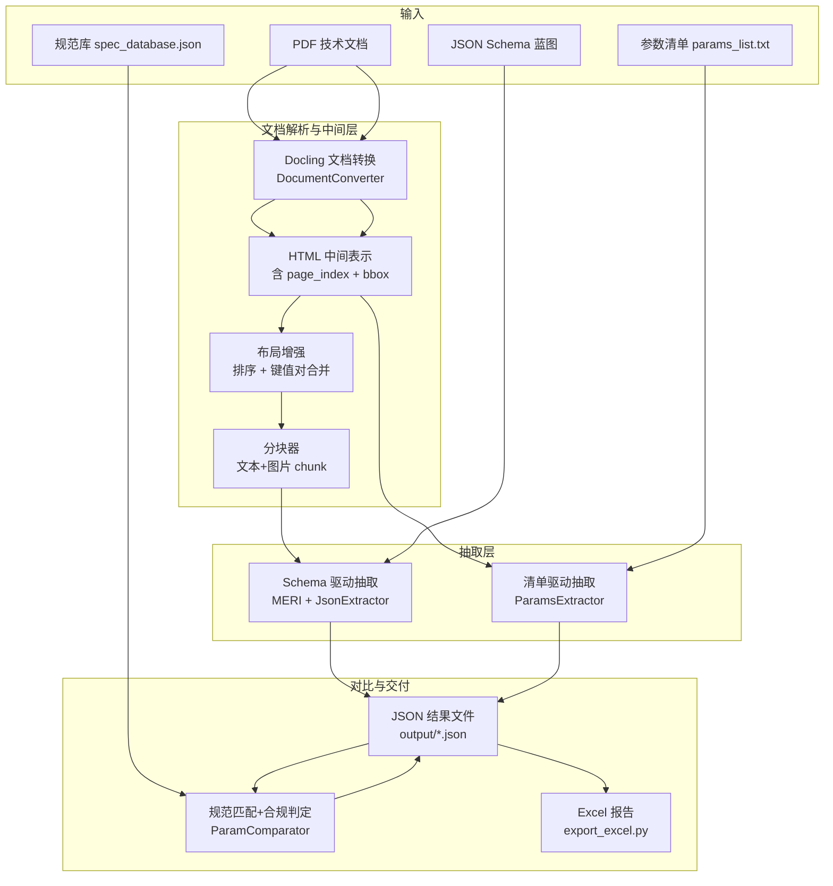

# 毕业设计说明书（软件类）——系统设计与实现（基于 MERI 项目）

> 说明：本文档只覆盖毕业论文/设计说明书中“**系统设计与实现**”相关正文内容，**背景、国内外研究现状、意义、参考文献**等章节你可自行补充。  
> 项目代码对应目录：`MERI-main/`。核心包：`meri/`；演示系统：`app/`；脚本工具：`extract_params.py`、`compare_params.py`、`export_excel.py`。

---

## 1. 项目定位与目标（面向“软件类毕业设计”的表述方式）

本项目实现了一个面向工程技术文档（以 PDF 为主）的**参数抽取与规范对比系统**。系统输入为技术协议/数据表等 PDF 文档，以及用户定义的“目标参数描述”（两种方式：JSON Schema 蓝图或参数清单）；系统输出为结构化抽取结果（JSON），并可进一步与规范数据库进行语义匹配与合规判定，最终生成可交付的 Excel 对比报告。

系统的核心目标可以拆解为三条闭环链路：

- **链路 A：结构化抽取（Schema 驱动）**  
  PDF →（Docling 版面分析 + 表格/图片解析）→ HTML 中间表示（含坐标与页码）→（多模态 LLM + 迭代填充）→ 按 JSON Schema 填充的结构化结果  
  对应实现：`meri/meri.py`、`meri/utils/docling_utils.py`、`meri/utils/html_post_processor.py`、`meri/intermediate_format/format_handler.py`、`meri/extraction/*`

- **链路 B：参数清单抽取（列表驱动）**  
 PDF → HTML → 文档分块 + 参数分批 → LLM 按清单逐项检索 → 命中参数归一化与去重 → JSON 输出（含未找到列表）  
 对应实现：`extract_params.py`

- **链路 C：规范对比与报告输出**  
 抽取结果 JSON + 规范库 JSON → LLM 语义匹配 → 合规判定 → JSON 对比结果 → Excel 报告（含样式与统计页）  
 对应实现：`compare_params.py`、`export_excel.py`、`spec_database.json`

此外，项目提供一个 Web 演示系统，用于上传 PDF 与 Schema、在线查看中间格式与抽取结果：`app/app.py`。

---

## 1.1 项目目录结构与模块对应（“老师看代码结构”的一节）

为保证论文中的“总体设计/模块划分”可与代码一一对应，本项目按“核心库 + 演示端 + 工具脚本 + 数据样例”的方式组织：

- **核心库（可复用）**：`meri/`
  - `meri/meri.py`：系统入口类 `MERI`，编排“解析→中间格式→抽取”
  - `meri/extraction/extractor.py`：`JsonExtractor`，负责按 Schema 驱动抽取
  - `meri/extraction/iterative_json_completion.py`：`IterativeJsonPopulator`，实现迭代式 JSON 填充（含 self-supervised 策略）
  - `meri/intermediate_format/format_handler.py`：`HTMLFormatHandler`，实现中间格式分块与多模态消息组织
  - `meri/utils/docling_utils.py`：Docling 文档对象到 HTML 的序列化（含 `bbox/page_index`）
  - `meri/utils/html_post_processor.py`：布局增强（排序、键值对合并、一对多值合并等）
  - `meri/utils/llm_utils.py`：LLM 适配层（OpenAI/Azure/Qwen/DashScope），统一 `chat_completion_request` 与 `complete_chat`
  - `meri/datamodels/datamodels.py`：表格数据模型（`TableModel/TableCellModel`）与 HTML/DF 转换
  - `meri/utils/utils.py`：PDF 页渲染、base64 编码、坐标缩放等通用工具

- **Web 演示端（交互式）**：`app/`
  - `app/app.py`：FastHTML Web 服务（上传、预览、抽取）
  - `app/statemanager.py`：`StateManager`（类变量）保存上传文件路径与当前 `MERI` 实例
  - `app/utils.py`：PDF 页渲染为图片并编码为 base64，用于前端轮播预览
  - `app/public/`：静态资源（CSS、logo）

- **工具脚本（批处理链路）**：
  - `extract_params.py`：按 `params_list.txt` 清单抽取参数（更贴合电气协议“参数表/参数列表”场景）
  - `compare_params.py`：抽取结果与 `spec_database.json` 规范库进行语义匹配与合规判定
  - `export_excel.py`：将对比结果导出为 Excel 报告（含统计页与样式）

- **数据与样例**：
  - `data/demo_data/`：示例 PDF、示例 schema（如 `dummy_schema.json`）
  - `spec_database.json`：规范库示例（含 A/B/C/D 参数类型）
  - `params_list.txt`：参数清单示例（逐行参数名）
  - `output/`：示例输出（JSON、Excel）

## 2. 需求分析（可直接作为正文“需求分析”章节）

### 2.1 业务/使用场景

在工程招投标、EPC 总包、设备选型与技术协议审核中，技术文档存在以下痛点：

- 参数散落在段落、表格、列表、图片标注中，人工查找耗时且易漏；
- 参数表达存在同义改写、设备名相似导致的误匹配；
- 抽取后还需要对照规范/标准进行合规判定，并整理成报告。

本系统的设计目标是将上述流程自动化、结构化与可复核化（保留页码与坐标信息，便于回溯原文）。

### 2.2 功能性需求

- **PDF 文档解析**：支持 PDF 原生文本或 OCR（可选）读取；识别段落/标题/列表/表格/图片等版面元素。
- **中间表示生成**：将文档转为机器可读的 HTML 片段序列，并为每个片段附带 `page_index` 与 `bbox`（坐标框）。
- **参数抽取（Schema 驱动）**：根据用户提供的 JSON Schema（含字段描述、目标单位等）输出结构化结果；支持分块与多轮迭代，提升稳定性。
- **参数抽取（清单驱动）**：根据 `params_list.txt` 中的参数名清单逐项抽取；输出命中项与未找到项。
- **规范匹配与合规判定**：将抽取参数与 `spec_database.json` 中的规范条目做语义匹配，输出合规/不合规/无法判断/未匹配分类结果。
- **报告导出**：将对比结果输出为格式化 Excel（含统计页与颜色样式）。
- **Web 演示**：提供上传、展示 PDF 页图、中间格式预览、抽取结果 JSON 展示的交互界面。

### 2.3 非功能性需求

- **可解释性/可复核性**：抽取结果包含 `bbox`、`pageIndex` 或原文片段，支持回溯定位。
- **鲁棒性**：对 LLM 返回的 JSON 解析失败要有重试与降级策略（项目中在多个模块实现了重试/容错）。
- **可扩展性**：通过 JSON Schema 扩展字段即可扩展可抽取的参数范围；规范库可直接维护为 JSON。
- **安全性**：API Key 不进入仓库，统一通过 `.env` 注入（见 `.env.example`、`meri/utils/llm_utils.py`）。

---

## 3. 系统总体设计

### 3.1 总体架构

系统采用“**文档理解中间层 + 任务驱动抽取 + 后处理与交付**”的分层架构。

### 3.2 运行形态与入口

项目提供三种典型运行形态，对应“开发、演示、批处理交付”三类需求：

- **作为 Python 包调用（推荐写进论文的‘系统形态’）**：`from meri import MERI`  
  - 主类：`meri/meri.py` 中的 `MERI`
  - 核心接口：`MERI.to_intermediate()`、`MERI.run(json_schema_str)`

- **命令式脚本（工程批处理）**  
  - 参数清单抽取：`extract_params.py`
  - 规范匹配对比：`compare_params.py`
  - Excel 报告导出：`export_excel.py`

- **Web 演示系统（交互式）**  
  - `app/app.py`，基于 `python-fasthtml`，端口 `5010`  
  - 支持上传 PDF/Schema、显示 PDF 页图、中间格式预览、抽取结果折叠展示

### 3.3 技术选型与依赖（写进“开发环境/关键技术”）

从 `pyproject.toml` 与 `requirements.txt` 可归纳关键依赖：

- **Docling**（`docling==2.5.2`）：PDF 版面元素识别（文本/表格/图片等）与结构化文档对象生成。
- **LiteLLM**（`litellm`）：统一封装 OpenAI/Azure/Qwen 等多模型调用，降低模型切换成本（实现见 `meri/utils/llm_utils.py`）。
- **多模态支持**：中间表示包含图片 `base64`，通过 messages 的 `image_url` 内容传递给多模态模型（实现见 `HTMLFormatHandler.prepare_gpt_message_content`）。
- **FastHTML + Tailwind/DaisyUI**：用于搭建轻量 Web demo（`app/app.py`）。
- **openpyxl**：生成 Excel 报告（`export_excel.py`）。

### 3.4 外部接口概览（把“怎么用”写成论文语言）

本项目对外提供三类接口，覆盖“库调用 / 脚本 / Web”：

- **Python API（核心库接口）**
  - `MERI(pdf_path, chunks_max_characters=450000, model='gpt-4o-mini', model_temp=0.0, do_ocr=False, do_cell_matching=True, enhance_layout=True, ocr_lang=None, n_rounds=2)`
  - `MERI.to_intermediate() -> None`：生成 `MERI.int_format`（HTML 中间表示）
  - `MERI.run(json_schema_str: str) -> dict`：返回按 schema 填充后的 JSON dict

- **批处理脚本（可写进“系统运行流程”）**
  - `extract_params.py`：读取 `params_list.txt`，输出 `output/ex*.json`
  - `compare_params.py`：读取 `output/ex*.json` 与 `spec_database.json`，输出 `output/com*.json`
  - `export_excel.py`：读取 `output/com*.json` 与 `output/ex*.json`，输出 `output/report_*.xlsx`

- **Web 演示接口（`app/app.py` 路由）**
  - `GET /`：主界面（PDF 预览 + 中间格式 + 抽取面板）
  - `POST /upload_pdf`：上传 PDF、渲染页图轮播预览（调用 `app/utils.py`）
  - `POST /to_intermediate`：创建 `MERI` 实例并生成中间格式（返回 HTML 预览）
  - `POST /upload_schema`：上传 schema 并展示 JSON
  - `POST /extract_parameters`：按上传 schema 执行抽取并展示 populated schema

---

## 4. 详细设计与实现（对应论文“详细设计”核心章节）

### 4.1 核心类 `MERI` 的职责与流程（`meri/meri.py`）

`MERI` 是系统的总控入口，承担“配置 → 解析 → 中间格式 → 抽取”的编排工作，关键成员与配置项：

- **输入**：`pdf_path`
- **解析与中间格式**：
  - `DocumentConverter`：Docling 转换器（支持 PDF pipeline option 配置）
  - `export_to_html()`：将 Docling 文档对象序列化为 HTML 片段序列
  - `enhance_html_for_extraction()`：可选布局增强（排序 + 键值对合并）
  - `HTMLFormatHandler`：中间格式处理与分块
- **LLM 抽取**：`JsonExtractor`（Schema 驱动抽取器）

为便于论文写成“接口 + 参数说明”的标准格式，可将构造参数解释为：

- **`chunks_max_characters`**：中间格式分块的字符阈值（结合模型上下文窗口设置）
- **`model` / `model_temp`**：LLM 名称与温度（通过 LiteLLM 适配多厂商）
- **`do_ocr` / `ocr_lang`**：是否启用 OCR 以及 OCR 语言（默认 `["ch_sim","en"]`）
- **`do_cell_matching`**：表格结构识别的 cell matching 开关（提升表格结构精度，计算成本更高）
- **`enhance_layout`**：是否启用布局增强（排序 + 键值对合并，面向“参数名在左、值在右”的文档）
- **`n_rounds`**：迭代抽取轮次（self-supervised 策略下多轮可提高稳定性，但会增加调用次数）

整体流程可描述为：

1. **`to_intermediate()`**  
   - 调用 Docling 将 PDF 解析为结构化文档对象；
   - 通过 `export_to_html()`生成 HTML 中间表示；
   - 若启用 `enhance_layout`，对 HTML 做布局增强（解决键值分离等问题）；
   - 创建 `HTMLFormatHandler`，用于后续分块与组装 LLM 输入。

2. **`run(json_schema_str)`**  
   - 若中间表示未生成，先调用 `to_intermediate()`；
   - 创建 `JsonExtractor`，设置分块阈值 `chunks_max_characters`、模型名称、温度、多轮迭代次数 `n_rounds`；
   - 调用 `populate_schema()`，输出按 Schema 填充后的 JSON 结果。

该设计在论文中可以强调：`MERI` 把“文档理解”和“任务抽取”解耦，便于替换不同解析器或不同抽取策略。

### 4.2 PDF→HTML 中间表示设计（`meri/utils/docling_utils.py`）

#### 4.2.1 中间表示的设计动机

直接把 PDF 原始文本送入 LLM 会丢失表格结构、图片信息、以及位置信息（无法复核）。因此系统引入“HTML 中间表示”，其特点是：

- **片段化**：按文档元素（段落、标题、表格、列表项、图片）拆成可序列化片段；
- **可定位**：每个片段携带 `bbox`（坐标框）与 `page_index`（页码索引）；
- **可多模态**：图片元素以 `base64`（Docling 提供的 `uri`）嵌入，后续可通过多模态模型理解图像内容；
- **可后处理**：HTML 片段的顺序与结构可进一步优化（排序、合并键值对等）。

#### 4.2.2 HTML 结构与标签约定

`export_to_html(document)` 会遍历 Docling 的 `document.iterate_items(...)`，将不同类型的元素映射为不同的 HTML 包裹：

- 标题：`<h1 className="title_wrapper" ...>...</h1>`
- 章节标题：`<h{level} className="section_wrapper" ...>...</h{level}>`
- 段落：`
...
`
- 普通文本块：`
...
`
- 表格：`
<table ...>...</table>
`
- 列表：`<ul className="list_wrapper"> <li ...>...</li> ... </ul>`（后续会被拆散重排）
- 图片：`

`

其中 `bbox` 与 `page_index` 通过 `prov_to_attr_dict()` 统一注入到元素属性中；坐标系转换使用 `docling_bbox_to_topleft()`，统一为“左上角原点”的坐标体系，便于排序与可视化。

补充说明（可写进论文“可复核性设计”）：  
由于每个 HTML 片段携带 `bbox/page_index`，因此抽取结果（无论是 Schema 还是清单模式）都可以在后处理阶段进一步建立“结果→原文定位”的映射，实现可视化高亮或人工复核流程（当前项目已具备必要的定位信息，只是尚未做完整的 UI 高亮展示）。

#### 4.2.3 表格结构建模（`meri/datamodels/datamodels.py`）

表格被抽象为 `TableModel`，核心为 `TableCellModel` 列表，每个 cell 同时保留：

- `text`：单元格文本
- `row_nums/col_nums`：行列跨度
- `col_header`：是否为表头
- `bbox`：单元格坐标

`TableModel.to_html(add_bbox_as_attr=True)` 将表格输出为 HTML `<table>`，并把单元格 bbox 作为属性写入，支持后续定位与复核。

### 4.3 布局增强：排序与键值对合并（`meri/utils/html_post_processor.py`）

工程技术协议中常见一种版式：**左侧是参数名（列表项），右侧是参数值（文本块），二者在视觉上同行但在解析结果中分离**。如果不处理，LLM 很容易把参数名和值分配错位或漏掉。

本项目实现了一个面向该问题的布局增强模块 `enhance_html_for_extraction()`，包含两步关键处理：

1. **按阅读顺序排序**：`sort_html_by_position()`  
   - 将 `<ul>` 拆散，把每个 `<li>` 当作独立元素；
   - 按 `page_index` 分组；
   - 页内按 y 坐标分行（差异小于阈值视为同一行），行内按 x 从左到右排序；
   - 输出排序后的 HTML 片段序列。

2. **按顺序合并键值对**：`merge_aligned_key_values_sequential()`  
   - 遍历排序后的元素序列；
   - 遇到 `<li>` 记为“当前参数名”；
   - 遇到右侧 `
` 时做匹配：
     - **首次匹配**：必须与参数名处于同一水平线附近（严格 y 容差），且 x 在参数名右侧；
     - **后续匹配**（一对多）：若值分多行，要求出现在上一个值的下方且 x 近似对齐；
   - 匹配成功后生成新的 `
参数名: 值1; 值2
`。

该模块的论文写法建议突出两点：

- 这是一个利用 `bbox`/`page_index` 的“版面几何启发式”算法，用于修复解析顺序与结构；
- 其目的不是替代 LLM，而是**提高 LLM 输入的“结构正确性”**，从而提升抽取精度与稳定性。

### 4.4 中间格式分块与多模态消息组织（`meri/intermediate_format/format_handler.py`）

抽取阶段需要控制输入长度以适配模型上下文窗口，因此 `HTMLFormatHandler.chunk()` 实现了分块逻辑：

- HTML 片段先被解析为二元组序列：`(type, cont)`，其中 `type ∈ {text, image}`；
- 计算 chunk 的“字符预算”：
  - 文本按实际字符长度计入；
  - 图片按近似 token 预算折算（代码中以 `4000` 字符近似每张图的成本）；
- 达到阈值即结束 chunk，并保留 `overlap` 个片段作为重叠，减少跨块信息丢失。

然后 `prepare_gpt_message_content()` 将 chunk 组装为 LLM 消息内容列表：

- 文本片段：`{"type":"text","text": ... }`（会把相邻文本合并）
- 图片片段：`{"type":"image_url","image_url":{"url": <base64>}}`

该设计保证抽取链路具备“多模态输入能力”，并在论文中可作为关键实现点描述。

### 4.5 Schema 驱动抽取：`JsonExtractor` 与迭代填充（`meri/extraction/*`）

#### 4.5.1 抽取器 `JsonExtractor`（`meri/extraction/extractor.py`）

`JsonExtractor.populate_schema(json_schema_string)` 的职责是：

- 调用 `format_handler.chunk()` 将中间格式切分为多个内容块；
- 将每个块转换为 LLM messages 所需的 `content` 结构；
- 构造 `IterativeJsonPopulator` 执行抽取；
- 对结果做后处理：`check_not_found_params()`  
  - 遍历 schema 的 `technicalSpecifications` 字段；
  - 如果结果中某参数 `value` 为空，则将其加入 `notFoundList`；
  - 保证输出具备“未找到项列表”，方便后续统计与人工复核。

#### 4.5.2 迭代式 JSON 填充 `IterativeJsonPopulator`（`meri/extraction/iterative_json_completion.py`）

该模块实现了三种迭代策略（枚举 `IterativePopulationStrategies`）：

- `ONE2ONE`：每个参数（或每条消息）只提取一次，提取到后不再继续找；
- `ONE2MANY`：同一参数可能多次抽取；
- `SELFSUPERVISED`（项目默认使用）：**模型每次看到“已抽取字典 + 当前内容块”后，自行决定补全或修正**。

其中 `SELFSUPERVISED` 的关键点在于：

- 使用 `generate_self_supervised_json_population_prompt(current_dict)` 生成提示词（`meri/prompts/prompts.py`），把“当前已填充的字典”作为上下文；
- 通过 OpenAI tools/function-calling 形式强制输出满足 schema 的 JSON：
  - `tools = create_openai_tools_arr('populate_json_schema', ..., schema)`
  - `tool_choice` 固定为 `populate_json_schema`
  - 最终解析 `tool_calls[0].function.arguments` 得到 JSON
- 支持 `n_rounds` 多轮遍历所有 chunks，实现“反复扫文档，逐步补全”的效果。

工程化容错点（可写进论文“鲁棒性设计”）：

- 对 API 返回为空、choices 为空、无 tool_calls 等异常给出明确错误提示并降级返回已有结果；
- 针对 rate limit 等错误输出建议（等待、升级额度、减小 chunk 等）。

### 4.5.3 LLM 适配层设计（`meri/utils/llm_utils.py`）

项目通过“模型名前缀”来自动选择不同厂商的调用方式：

- **Azure OpenAI**：模型名形如 `azure/<deployment-name>`  
  - 环境变量优先读取 `AZURE_OPENAI_API_KEY`、`AZURE_OPENAI_ENDPOINT`、`AZURE_OPENAI_API_VERSION`；兼容 LiteLLM 传统命名 `AZURE_API_*`（见 `.env.example` 与 `_get_azure_openai_config()`）
- **通义千问（DashScope OpenAI 兼容模式）**：模型名形如 `qwen/<model>`  
  - 读取 `DASHSCOPE_API_KEY`，并把请求路由到 `https://dashscope.aliyuncs.com/compatible-mode/v1`
- **其他模型**：直接使用 LiteLLM 的默认 `completion()` 调用

该适配层使得论文中的“系统实现”可以更自然地论证：系统与具体模型供应商解耦，可根据成本/性能在 Azure/OpenAI/Qwen 间切换。

### 4.6 清单驱动抽取脚本（`extract_params.py`）

该脚本适用于“参数项固定且数量较多”的工程场景（例如电气设备技术协议参数表），其实现特点是“**以参数清单为锚，强制逐项检索**”。

核心类 `ParamsExtractor` 的流程：

1. **读取参数清单**：`load_params_list(params_list.txt)`  
   - `params_list.txt` 每行一个参数名（例如“断路器分闸时间”）

2. **PDF→HTML**：`_convert_to_html()`  
   - 使用 `DocumentConverter` + `export_to_html()` 生成 HTML

3. **双重分块**  
   - 文档分块：`_chunk_document()` 按标签边界（`</table>`, `
` 等）尽量在语义边界处截断；
   - 参数分批：`_chunk_params()` 将参数列表按 `PARAMS_BATCH_SIZE` 分批，避免一次 prompt 过长。

4. **LLM 抽取**：`_extract_batch()` → `_call_llm()`  
   - 使用 `EXTRACTION_PROMPT` 强调表格优先、设备名严格区分、语义匹配与数值/单位完整性；
   - `response_format={"type":"json_object"}` 强制 JSON 输出；
   - 失败重试 3 次；若 JSON 解析失败，尝试 `_try_fix_json()` 兜底修复。

5. **参数名归一化与去重**  
   - `_normalize_name()` 去除常见符号、空格等，便于鲁棒匹配；
   - `_match_param_name()` 采用“三段式策略”：
     - 原文精确匹配；
     - 标准化后精确匹配；
     - 包含匹配（但要求设备名一致：断路器/隔离开关/接地开关等）。

6. **输出**  
   - 结果包含：`parameters`（按清单顺序）、`not_found`（未命中清单项）、统计信息与元数据。

论文建议强调：清单驱动抽取是一种“**强约束抽取策略**”，能在参数量大、命名规则相对稳定时提高覆盖率，并通过设备名约束降低误匹配。

### 4.7 规范匹配与合规判定（`compare_params.py`）

该模块的目标是把抽取结果转化为“可审查的合规结论”，其输入与输出约定：

- 输入 1：抽取结果 `output/ex*.json`（来自 `extract_params.py`）
- 输入 2：规范库 `spec_database.json`
- 输出：对比结果 `output/com*.json`，并按类别分组（符合/不符合/未匹配/无法判断）

规范库条目包含 `type`（A/B/C/D）：

- A：关键参数，不可变更
- B：变更需提交审核
- C：可根据情况调整
- D：通用参数，变更需特殊申请

`COMPARE_PROMPT` 明确约束：

- 设备名必须匹配；
- 参数名允许语义等价；
- 数值判断规则：支持 `≤/≥/范围`；对“能力型参数”（额定电流、电压、耐受值等）采用“用户要求 ≤ 规范能力 → 合规”的逻辑；机械寿命等作特殊规则；
- 未匹配则 `matched_spec_name=null`，并将 `is_compliant` 置为 `null`。

实现上采用**分批**调用（`BATCH_SIZE`），降低一次调用的上下文长度与失败概率。

### 4.8 Excel 报告导出（`export_excel.py`）

该模块将对比结果转化为工程交付物，主要实现点：

- 工作簿包含：
  - `参数对比结果`：逐行列出用户参数、用户值、匹配规范参数、规范值、类型、是否合规（✓/✗/-/?）
  - `统计信息`：汇总抽取覆盖率、对比统计、按类型统计、文件信息
- 样式策略：
  - 表头蓝底白字；
  - 合规绿色、不合规红色、未匹配灰色；
  - A/B/C/D 类型列按不同底色区分；
  - 末尾追加“未提取到的参数”分隔区块，便于审阅。

### 4.9 Web 演示系统实现（`app/app.py`、`app/statemanager.py`、`app/utils.py`）

Web demo 的设计目标是：**让评审或用户在浏览器中完成“上传→预览→生成中间格式→执行抽取→查看 JSON”**，降低理解门槛。

- **状态管理**  
  - `StateManager` 使用类变量保存：`pdf_path`、`schema_path`、`meri` 实例、`populated_schema`。  
  - 这种实现简单直接，适合单用户/演示环境；若面向多用户并发，应改为 session 或数据库存储。

- **PDF 预览**  
  - `app/utils.py` 使用 PyMuPDF（`fitz`）逐页渲染图片，并转为 base64，前端使用 carousel 轮播展示。

- **关键路由与逻辑**  
  - `/upload_pdf`：保存上传文件到 `uploads/`，更新 `StateManager.pdf_path`，返回页图预览组件  
  - `/to_intermediate`：创建 `MERI(StateManager.pdf_path, model=args.model)` 并调用 `to_intermediate()`，把 HTML 中间表示渲染到页面  
  - `/upload_schema`：保存 schema 文件、更新 `StateManager.schema_path`，并用折叠面板展示 JSON  
  - `/extract_parameters`：读取 schema，调用 `StateManager.meri.run(json.dumps(schema))`，展示 populated schema

论文写法建议：将 demo 描述为“系统原型与验证工具”，其价值在于可视化中间表示，便于调试与演示抽取效果。

---

## 5. 数据与文件格式设计（建议论文中单独成章）

### 5.1 Schema 驱动抽取的 JSON Schema 约定（示例：`data/demo_data/dummy_schema.json`）

Schema 的核心思想是：把“要抽取什么”写成可机器校验的蓝图。项目示例 schema 定义了：

- `title`：文档标题（含 text、bbox、pageIndex）
- `technicalSpecifications`：目标参数集合，每个参数内包含：
  - `label/description`：语义说明（指导模型理解）
  - `desiredUnit`：目标单位（提示模型做单位换算）
  - `parameter_properties`：
    - `value`：数值（示例 schema 定义为 number）
    - `text`：原文文本
    - `unit`：单位
    - `bbox/pageIndex`：来源定位信息
- `notFoundList`：未找到的字段名列表

> 注意：示例 schema 中 `value` 为 `number`，因此更适合抽取可解析为数值的参数；若你的毕业设计面向“电气技术协议”，很多值是 `≤28ms`、`50/60Hz` 等复杂表达，实践中可考虑把 `value` 设计为 `string` 或同时保留 `raw_value`。

### 5.2 清单驱动抽取的输出格式（`extract_params.py`）

脚本输出为严格 JSON，结构如下：

- `parameters`: `[ {name, value, unit, original_text}, ... ]`
- `not_found`: `[ "未找到的参数名", ... ]`
- `statistics`: `{ total_requested, found, not_found }`
- 以及 `source_file`、`extraction_time`、`model` 等元数据

### 5.3 规范数据库格式（`spec_database.json`）

规范库文件是一个简单可维护的 JSON：

- `type_definitions`：类型含义说明
- `parameters`: `[ {name, value, type}, ... ]`

该结构便于后续扩展：

- 增加字段：例如 `unit`、`upper_bound`、`lower_bound`、`standard_ref`（引用条款）；
- 增加版本：按设备型号/电压等级拆分多个规范库文件。

---

## 6. 关键算法与策略总结（写进论文“关键技术/创新点”）

### 6.1 两阶段抽取范式

项目采用“先结构化文档，再做语义抽取”的范式：

1. Docling 把 PDF 解析为结构化元素（文本/表格/图片），保留 `bbox/page_index`；
2. LLM 在结构更清晰的中间格式上做 Schema 填充或清单检索。

优点是减少 LLM 直接读 PDF 导致的结构丢失问题，并提高可复核性。

### 6.2 版面几何启发式：排序与键值对合并

利用 `bbox` 的几何关系（同页、同 y、右侧、对齐、上下延续）把“参数名-参数值”重新绑定，提升列表/参数表类文档的抽取质量。

### 6.3 迭代式自监督填充（Self-supervised）

通过让模型反复扫描 chunks，并在每次输入中携带“已抽取字典”，实现逐步补全与纠错；同时借助 function-calling 强约束输出结构，降低 JSON 格式错误率。

### 6.4 工程化鲁棒性

- 多次重试与 JSON 兜底修复（清单驱动脚本）；
- API 异常明确化与降级返回（Schema 驱动迭代抽取）。

---

## 7. 部署与运行设计（写进论文“运行环境/部署方案”）

### 7.1 本地运行

- Python：`>=3.11,<3.13`（见 `pyproject.toml`）
- 依赖：Poetry（推荐）或 `pip install -r requirements.txt`
- API Key：复制 `.env.example` 为 `.env` 并填入密钥

### 7.2 Docker 运行（Web demo）

`docker-compose.yml` 将 demo 暴露在 `5010` 端口：

- 构建镜像：`docker/dev.Dockerfile`（安装 Poetry、系统依赖）
- 运行命令：容器内执行 `poetry install && poetry run python app/app.py --model azure/gpt-4o`

> 论文建议补充：在实际部署时，应将 `.env` 通过安全方式注入（例如 CI/CD secret、环境变量管理平台），避免硬编码。

---

## 8. 测试与验证（写进论文“测试”）

项目提供了可复现实验脚本 `test_meri.py`，可作为“系统测试用例”的基础材料：

- **输入**：`data/demo_data/final.pdf` 与 `data/demo_data/all_data.json`
- **流程**：初始化 `MERI` → `to_intermediate()` →（可选）`vis_layout()` → `run(schema)`
- **输出**：保存中间 HTML 以便调试、保存抽取结果 JSON

建议你在论文中补充两类评价指标（可用你的项目数据跑出来）：

- **抽取质量**：覆盖率（Found/Total）、准确率（人工抽检）、单位换算正确率；
- **对比质量**：匹配成功率、合规判定一致性（与人工判断对比）。

---

## 9. 本章小结（可直接放在章节末）

本章围绕 MERI 项目给出了完整的系统设计与实现说明：系统采用 Docling 构建可定位的 HTML 中间表示，并通过多模态 LLM 按 Schema/清单两种方式抽取参数；在此基础上实现了规范语义匹配与合规判定，并输出工程可用的 Excel 报告；同时提供 Web demo 方便交互式验证。该设计在可扩展性、可复核性与工程交付性之间取得平衡，为后续在更多设备类型与更大规模规范库上的应用提供了基础。

